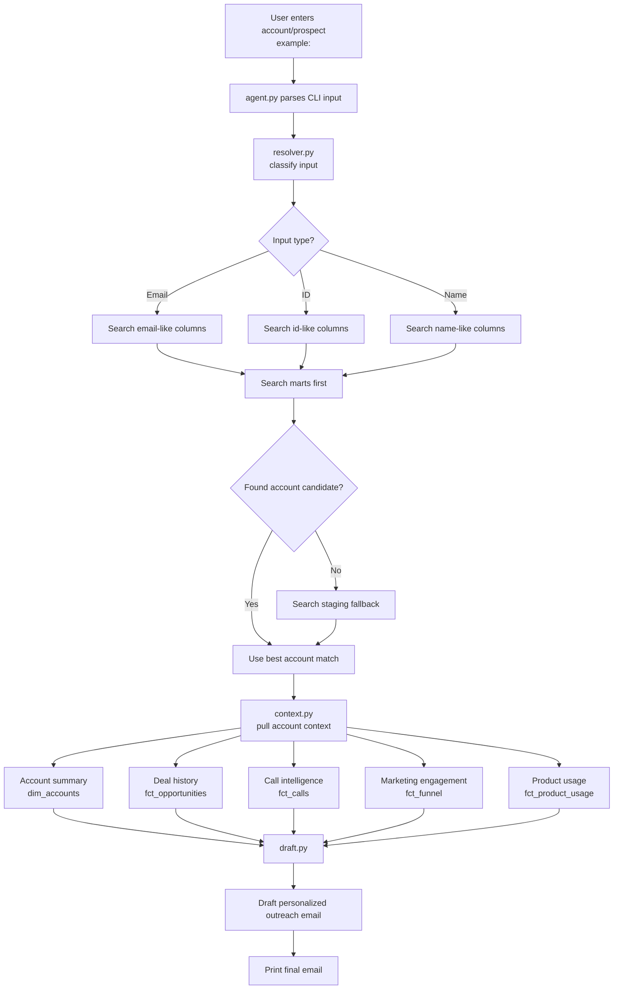

# Mini Data Platform — GTM Edition

This repo is a synthetic data platform containing mock GTM data — CRM records, sales call intelligence, marketing automation, and product analytics — along with Airflow DAGs, dbt models, Evidence dashboards, and a DuckDB data warehouse.

## Assignment

Build an agent that, given an account or prospect, pulls together relevant internal context — deal history, product usage, call intelligence, marketing engagement — and drafts a personalized outreach email. Try to discover the schema dynamically rather than hardcoding table and column names. No requirements around languages, model providers, or methods — we want to see how you think about these problems.

To submit, send us a link to your fork with a README outlining your approach and where you'd continue building if you had more time. This should take no more than a few hours.

We're looking forward to seeing your work!

## My approach

My approach to this assignment can be split into three major steps.

* Input Resolution
  * Given a user input at the terminal (email, name, ID)
  * Classify the user input and search the warehouse
  * Search ```marts``` schema wherever possible, since that is the cleaned data
    * Attempt to dynamically search through the database. Assign different roles for columns based on their names.
    * For each column, search for the input. Use exact matching for emails and IDs, but fuzzy matching for names ("apex" input can find "Apex Group" or "Apex Technologies")
  * Fallback to ```staging``` if no results are found in marts
  * Once a match is found, return an ```account_id```

* Gather context 
  * After we find the account, ```context.py``` retrieves data from the marts tables
    * Account summary from dim_accounts
    * Deal history from fct_opportunities
    * Recent call intelligence from fct_calls
    * Marketing engagement from fct_funnel
    * Product usage from fct_product_usage
  
* Drafting the email
  * ```draft.py``` takes the gathered context and creates a short email. 
  * The personalized email prioritizes deal context, then product usage, then marketing engagement.
  * CLI prints the final drafted email. 
Below is a flowchart outlining my approach to this assignment


## Future implementations

In regards to dynamically searching the database, given more time I would have used cosine similarity to determine how similar an output is to an input. I believe this would yield more accurate confidence measurements, and better candidate finding as a result. Also, right now the agent simply picks the top scoring result, in a more robust solution, there will be a disambiguation step added to specify which company is the intended recipient("apex" input to "Apex Technologies" vs "Apex Group"). 

In regards to the email drafting itself, with LLM models being so readily available, I think it would be best to offload the email writing part to an LLM. A rudimentary approach would be to simply link an ChatGPT API key and send the request to ChatGPT, however, this will end up being costly in the long run, as well as sensitive data being uploaded to OpenAI servers. A better approach could be to use a smaller local model instead, since writing emails using provided data is not necessarily a difficult task that requires incredible amounts of compute. I chose not to implement the local model due to the size of the model being a few GB, which is impractical to upload to github. Given more time to work on this, I think the local LLM could do an even better job if I had access to previously written outreach emails, from which I can build a RAG pipeline so the drafting step can learn from pervious examples of effective messaging. 